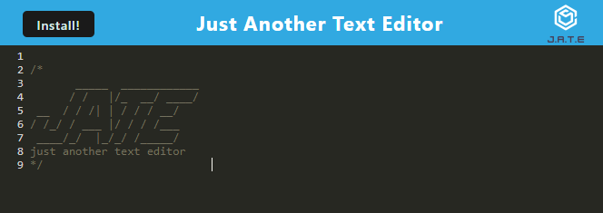
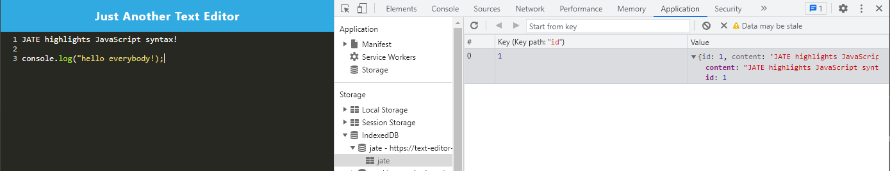

# Text-Editor 

## Description
The motivation for this project was to explore creating a single-page application that meets the Progressive Web Application criteria using IndexedDB for storage, and Webpack for creating a dist build. The application itself is a simple text editor that uses Webpack to generate a JSON manifest and service-worker.By building this project, I learned to use and configure Webpack for creating PWAs.

## Table of Contents

- [Installation](#installation)
- [Usage](#usage)
- [License](#license)
- [Contributing](contributing)
- [Questions](#questions)

## Installation

Run the command 'npm i' while in the root project directory. This will install the required serverside and clientside node packages. 

Run 'npm run build' to create the dist directory using webpack for the client.

Run 'npm run start' or 'npm run start:dev' to run the server locally. Navigate to localhost:3000 to view the application.

## Usage

To use the application, if running locally, navigate to localhost:3000 in your web browser. On first load of the application, the text editor will be prefilled with the JATE header and you are now free to begin using the text editor.

The text editor is set to run a put method to the IndexedDB database whenever the text editor is unfocused. You can do this by clicking on the blue header bar, or by navigating to another browser tab. You can use the Chrome Developer Tools Application tab to view the stored data under Storage > IndexedDB > jate > jate. 

The application also functions while offline. To test this a developer, in the Chrome Developer Tools Appolication tab navigate to Application > Service Worker and set the Offline checkbox to checked. Then, update the content of the text editor and refresh the page. You will see that the text editor is updated with the new content.

Lastly, the application is able to be installed locally by clicking the 'Install!' button in the upper-lefthand corner of the viewport. Doing so will install the application locally and create a desktop shortcut to run the text editor without navigating through your web browser.

## License

N/A

## Contributing

N/A

## Questions

An example run of the application is deployed on Heroku at https://text-editor-ryanafernandez.herokuapp.com/.

If you have any questions about the repo, open an issue or contact me directly at ryanfernandez11@gmail.com. You can find more of my work at [my GitHub page](https://github.com/ryanafernandez/).
